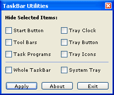



## TaskBar Utilities \- Made Easy

### Description

TaskBar Utilities - Made Easy is a program that hides the specific aread of TaskBar made easy...

Please Vote!!! Thank You!!!
 
### More Info
 

             |
---                |---
**Submitted On**   |2004-03-23 00:19:44
**By**             |[Jovica Mizdrak](https://github.com/Planet-Source-Code/PSCIndex/blob/master/ByAuthor/jovica-mizdrak.md)
**Level**          |Advanced
**User Rating**    |3.7 (11 globes from 3 users)
**Compatibility**  |VB 5\.0, VB 6\.0
**Category**       |[Miscellaneous](https://github.com/Planet-Source-Code/PSCIndex/blob/master/ByCategory/miscellaneous__1-1.md)
**World**          |[Visual Basic](https://github.com/Planet-Source-Code/PSCIndex/blob/master/ByWorld/visual-basic.md)
**Archive File**   |[TaskBar\_Ut1724323252004\.zip](https://github.com/Planet-Source-Code/jovica-mizdrak-taskbar-utilities-made-easy__1-52640/archive/master.zip)

